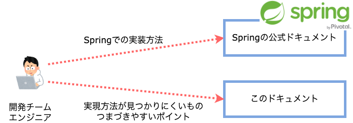

このドキュメントについて
====================================

このドキュメントでは `Spring <https://spring.io/>`_ を活用してアプリケーションを構築する際に必要となるノウハウを提供します。

特に、アプリケーションを開発する際に公式ドキュメントやWeb上から実装方法を見つけることが難しく、躓きやすい点についての情報を中心に提供します。

.. _target-user:

対象読者
------------------------------------

このドキュメントは、ソフトウェア開発経験のあるアーキテクトやプログラマ向けに書かれています。

特に、Springについて、次のような知識・能力を持っていることを前提としています。

* 共通

  * `Spring Boot <https://projects.spring.io/spring-boot/>`_ を利用して開発したことがあり、基本的な仕組みについて理解している。
  * `Spring Framework <https://projects.spring.io/spring-framework/>`_ を利用したアプリケーションの基本的なアーキテクチャについて理解している。
  * `Springの公式ドキュメント <https://spring.io/docs>`_ から適切な情報を検索できる。
  * その他、次にあげるような技術要素について、基本的な知識を持っている。

    * SQL
    * Maven

* Web/API

  * :spring-framework-doc:`Spring Web MVC <reference/html/web.html#spring-web>` の基本的な用語を理解している
  * Spring Web MVCの各ステレオタイプの役割を理解している
  * Spring Web MVCの処理フローを理解している

* バッチ

  * `Spring Batch <https://spring.io/projects/spring-batch>`_ の基本的な用語を理解している
  * Spring Batchの各ステレオタイプの役割を理解している
  * Spring Batchの処理フローを理解している

これからSpringを初めて利用するという人は、`公式ガイド <https://spring.io/guides>`_ 等を活用して学習してください。

このドキュメントの使い方
------------------------------------

基本的な実装方法については、Springの公式ドキュメントを参照してください。

また、実装を進める中でSpringを利用したアプリケーションのアーキテクチャについてより深く理解する必要が出た場合は、まず `Macchinetta Framework <https://macchinetta.github.io>`_ を参照することをおすすめします。
ただし、このドキュメントとMacchinettaでは、設定の記載方法が異なるため、具体的な実装例や設定例はそのままでは利用できないと考えてください。（このドキュメントではJava Config、MacchinettaではXML Configを使用している）

* :macchinetta-server-guideline-thymeleaf-doc:`Macchinetta Server Framework Development Guideline <>`
* :macchinetta-cloud-guideline-doc:`Macchinetta Server Framework Cloud Extension Development Guideline <>`
* :macchinetta-batch-guideline-doc:`Macchinetta Batch Framework Development Guideline <>`

.. _test-environment-and-dependencies:

動作確認環境と依存ライブラリについて
------------------------------------

このドキュメントに含まれるサンプルコードは、 :sample-app:`サンプルアプリケーション <>` を利用して以下の実行環境でテストしています。

.. list-table:: 実行環境

   * - OS
     - Amazon Linux 2
   * - JDK
     - Liberica JDK 17

また、明示的に依存しているのは以下のライブラリです。

Spring Boot
  Spring Bootから参照されるライブラリのバージョンは、 :spring-boot-doc:`Appendix F. Dependency versions <reference/html/dependency-versions.html#appendix.dependency-versions>` を参照してください。

  .. literalinclude:: ../../samples/pom.xml
     :language: xml
     :start-after: spring-boot-version-start
     :end-before: spring-boot-version-end
     :dedent: 2

その他のライブラリ
  以下のライブラリをすべてのサンプルで利用しているわけではありません。サンプルごとに利用しているライブラリは、サンプルのpom.xmlで確認してください。

  .. literalinclude:: ../../samples/pom.xml
     :language: xml
     :start-after: other-versions-start
     :end-before: other-versions-end
     :dedent: 6

これらの実行環境・ライブラリのバージョンアップには可能な限り追随し、テストが失敗する場合にはドキュメント含めて修正する予定です。

ご利用にあたって
------------------

当サイトでは、ブラウザによる閲覧履歴等の情報を収集しております。
以下に、情報の利用目的や各情報の具体的な用途を示します。

情報の利用目的
~~~~~~~~~~~~~~~~

取得した情報はアクセス解析に利用されます。
ページのアクセス数等からサイトの利用状況を把握し、サイトの改善に利用します。
アクセス情報は匿名で収集され、個人を特定することはできません。

情報の送信先
~~~~~~~~~~~~~~~~

取得した情報は\ `Plausible
Analytics <https://plausible.io>`__\ に送信されます。

情報の種類・用途
~~~~~~~~~~~~~~~~

利用する情報は以下のとおりです。

.. list-table::
   :widths: 15 30 25 30
   :header-rows: 1
   :class: white-space-normal

   * - 情報の種類
     - 例
     - 説明
     - 用途

   * - ページのURL
     - https://fintan-contents.github.io/spring-crib-notes/latest/html/index.html
     - 当ウェブサイトのURL
     - どのページが閲覧されたか測定するために使用されます。

   * - リファラー
     - https:////twitter.com/
     - 参照元ページ
     - どのページから当サイトに到達したかを測定するために使用されます。

   * - ブラウザ
     - Chrome 86.0
     - 利用者のブラウザの種類
     - 利用者の閲覧環境を測定するために使用されます [1]_。

   * - OS
     - macOS 10.15
     - 利用者のOSの種類
     - 利用者の閲覧環境を測定するために使用されます [2]_。

   * - デバイス種別
     - Desktop
     - 利用者のデバイスの種類
     - 利用者の閲覧環境を測定するために使用されます [3]_。

   * - 国、地域、都市
     - United Kingdom, England, London
     - 利用者の位置情報
     - 利用者の閲覧環境を測定するために使用されます [4]_。

より詳細な情報については、\ `Plausible
Analyticsのポリシー <https://plausible.io/data-policy>`__\ をご参照ください。

.. [1]
   ユーザーエージェントから取得しますが、必要な情報だけを使用します。完全なユーザーエージェントは破棄されます。

.. [2]
   ユーザーエージェントから取得しますが、必要な情報だけを使用します。完全なユーザーエージェントは破棄されます。

.. [3]
   ユーザーエージェントから取得しますが、必要な情報だけを使用します。完全なユーザーエージェントは破棄されます。

.. [4]
   IPアドレスを使用して位置情報を取得しますが、都市レベルより詳細な追跡は行いません。IPアドレスは破棄されるため、データベース等に保存されることはありません。
